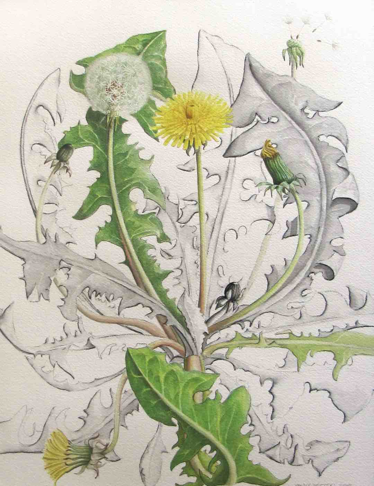

# Markdown helper

## Headings

# Heading Level 1

## Heading Level 2

### Heading Level 3

## Text formatting

_Italicised text_, **bold text** and `code text`. Code text is made with back-ticks which can be weird to find on some keyboards. Look it up.

## Blockquote

> We live in capitalism. Its power seems inescapable. So did the divine right of kings. Any human power can be resisted and changed by human beings. Resistance and change often begin in art, and very often in our art - the art of words.

Ursula K. Le Guin

## Ordered list

1. A thing
2. Another thing
3. Even more of a thing

## Bullet list

- One bullet
- Another
- Also another

## Horizontal rule:

---

## Link

This is a fork of [the original php version of lichen](https://lichen.sensorstation.co/unmaintained//)

## A local image

## An external image

